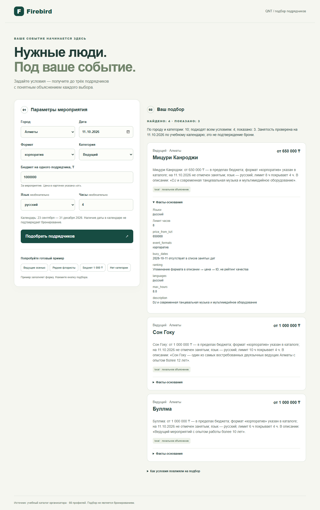
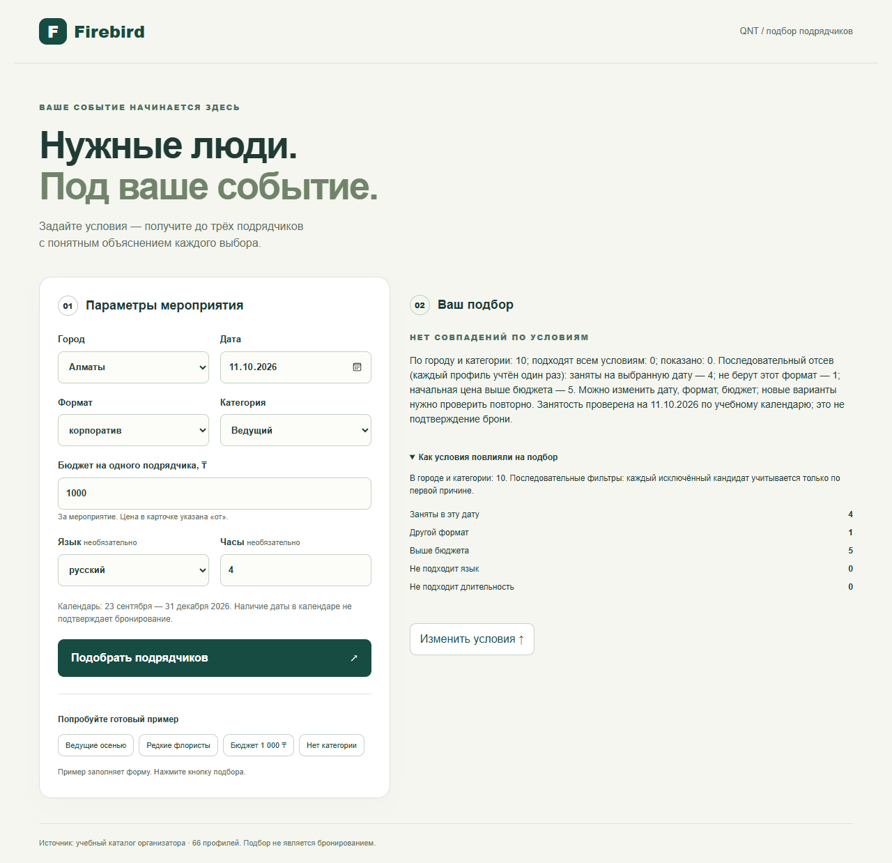
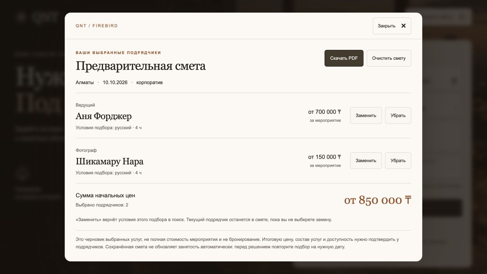

# QNT · Firebird

**Умный подбор подрядчиков для организаторов мероприятий.** Вместо просмотра длинного каталога задайте условия события и получите до трёх подходящих вариантов с ценами «от», объяснениями и проверяемыми фактами. Выбранных подрядчиков можно собрать в предварительную смету и скачать PDF.

**[Открыть демо](https://qnt.l33t.kz/)** · [Проверка проекта](docs/ORGANIZER_AUDIT.md) · [Источник данных](data/README.md)


*Снимки сделаны с текущего `main` и настоящего локального API при отключённом AI и UI-деморежиме.*

После поиска открывается отдельный экран результатов с закреплёнными условиями; на телефоне объяснения и факты читаются без горизонтальной прокрутки. Смета, PDF и возврат к форме сохранены. [Проверка интеграции](docs/UI_INTEGRATION_2026-09-23.md).

<details>
<summary>Скриншоты: главная, выбор и пустой результат</summary>


</details>

## Что реализовано

- **Подбор по условиям:** город, дата, формат, категория и бюджет; язык и длительность — по желанию. Код проверяет условия, учитывает учебный календарь занятости и возвращает до трёх карточек.
- **Прозрачные объяснения:** причины выбора, факты из каталога и причины отсева. `local` означает объяснение без AI; при включённом AI модель может выбрать цитату из описания, но не меняет фильтрацию и порядок выдачи.
- **Предварительная смета:** выбор и замена подрядчиков, сохранение черновика в браузере, экспорт PDF. Цены указаны **«от» за подрядчика на мероприятие**; синтетические и дополненные данные отмечены.

## Как работает решение

1. Организатор вводит параметры события. Интерфейс получает справочники через `/api/options` и отправляет запрос в `/api/match`.
2. Сервер проверяет входные данные, отбирает профили из каталога и детерминированно упорядочивает подходящих. Объяснение использует факты и исходное описание подрядчика; AI необязателен.
3. Отдельный экран результатов показывает до трёх карточек или понятную пустую выдачу. Условия остаются в закреплённой шапке; пользователь раскрывает основания выбора и добавляет нужных подрядчиков в смету.

## Технологии и архитектура

| Компонент | Технологии и роль |
|---|---|
| Интерфейс | TypeScript, React, Vite. Форма, карточки, локальная смета; `pdf-lib` и `@pdf-lib/fontkit` создают PDF в браузере. |
| API | Python, FastAPI, Pydantic. Валидация, фильтрация, порядок выдачи и формирование объяснений; тот же сервер раздаёт собранный интерфейс. |
| Данные и AI | CSV-каталог организатора кейса. Без ключа работает локальный выбор фактов; опционально OpenAI Responses API (`gpt-4.1-mini`) выбирает цитату из разрешённых фрагментов. |

Запрос проходит путь **форма → API → каталог и алгоритм подбора → карточки → смета/PDF в браузере**. AI не принимает решение о соответствии условиям.

## Установка и запуск без ключа

Нужны Python 3.10–3.12 и Node.js 22.12+. Из корня репозитория:

```bash
cd frontend
npm ci
npm run build
cd ..
python3 -m venv .venv
source .venv/bin/activate
python -m pip install -r backend/requirements.txt
python -m uvicorn app.main:app --app-dir backend --host 127.0.0.1 --port 8000
```

Откройте **http://127.0.0.1:8000/**. API и интерфейс доступны с одного адреса. По умолчанию AI и UI-деморежим выключены; ключ и аккаунт не требуются. В Windows PowerShell используйте `npm.cmd`, создайте окружение командой `py -3.12 -m venv .venv` и активируйте `.venv\Scripts\Activate.ps1`.

## Как проверить

1. Оставьте пример в форме: **Алматы · 10.10.2026 · корпоратив · Ведущий · 1 000 000 ₸ · русский · 4 часа**. Нажмите «Подобрать подрядчиков». В текущем каталоге ожидаются **4 подходящих профиля, 3 показанные карточки**.
2. Раскройте «Проверенные условия и факты» у первой карточки, нажмите «Выбрать в смету», затем «Посмотреть смету». При желании скачайте PDF.
3. Повторите запрос с бюджетом **1 000 ₸**: интерфейс должен показать пустую выдачу и причины отсева, а не подменять ответ демоданными.

Автоматическая проверка без платных AI-вызовов: `python backend/scripts/judge_check.py`. В [интеграционной проверке](docs/UI_INTEGRATION_2026-09-23.md) прошли **100 backend** и **36 frontend** тестов, production-сборка и контрольные сценарии; это локальные результаты, не успешный CI. Отдельно доступны `cd frontend && npm test` и `python -m pytest -q backend/tests`; [машинный отчёт](docs/verification-results.json) и [сценарии приёмки](docs/ACCEPTANCE.md) лежат в `docs/`. Зелёного бейджа CI нет: в документации зафиксирован billing-блокер GitHub Actions, успешный run не подтверждён.

## Данные и ограничения

Используется предоставленный организатором CSV-каталог: **66 анонимизированных профилей в 17 категориях**. Часть профилей синтетическая, некоторые города и цены дополнены; интерфейс сохраняет соответствующие метки. [Происхождение и ограничения набора данных](data/README.md). Внешний сервис нужен только для необязательного AI-режима; обычный подбор работает локально без ключа.

Календарь ограничен **23.09–31.12.2026** и не подтверждает реальную доступность или бронирование. Описания и начальные цены нужно уточнять у подрядчика. Интернет-поиск, заявки, оплата и бронирование не входят в текущую версию; смета не является полной стоимостью события.

## Подробные материалы

<details>
<summary>Примеры подрядчиков и архивные скриншоты</summary>

Эти примеры и снимки — из предыдущего README. Они показывают локальный API на 23.09.2026, не текущий публичный сервер; новая запись текущего интерфейса размещена выше.

Для корпоратива в Алматы 10 октября карточки показывают разные основания выбора:

- **Куррапика:** если важна специализация на корпоративных и деловых мероприятиях; рядом точная цитата о специализации.
- **Аня Форджер:** если в приоритете развлечения и танцы; основание — «Только развлечения и танцы».
- **Сон Гоку:** если важна подача с юмором; основание — описание стиля ведущего.

Это условные ориентиры выбора, а не приписанные заказчику пожелания или гарантии результата. В AI-режиме модель выбирает доказательство из описания, код превращает его в краткое объяснение; в `local` выбор делает код. Бюджет, язык, длительность и календарь видны отдельно в фактах. При слабом описании система честно показывает ограниченность оснований. Полезность индивидуального объяснения важнее количества упоминаний AI.

Материалы Бекзат: настоящий локальный API и исходный каталог, `ENABLE_AI=false`, UI-фикстуры выключены. Снимки сделаны 23.09.2026 при ширине 1280 px до уточнения выбора цитат в `4e99e87`: отдельные тексты объяснений в текущей версии могут отличаться. Это не снимки публичного сервера и не доказательство проверки на телефоне.

Алматы · ведущий · корпоратив · 11.10.2026 · 1 000 000 ₸ · русский · 4 часа. Три карточки и раскрытые факты:



Пустая выдача: тот же сценарий с бюджетом 1 000 ₸



</details>

<details>
<summary>Смета и PDF: подробный сценарий</summary>

1. Выполните подбор и нажмите **«Выбрать в смету»** на карточке.
2. Выберите следующую категорию для того же города, даты и формата, выполните подбор и добавьте подрядчика.
3. **«Посмотреть смету»** справа сверху открывает окно с выбранными услугами и суммой начальных цен. **«Заменить»** закрывает окно и возвращает исходные условия этой позиции в форму; старая позиция остаётся до выбора новой. Окно закрывается кнопкой, Escape или нажатием на затемнённый фон.
4. **«Скачать PDF»** сохраняет оформленный документ A4 с событием, позициями, условиями, отметками данных и итогом. Кириллические шрифты встроены в PDF; длинные сметы продолжаются на следующих страницах. PDF создаётся в браузере без AI и отправки сметы на сервер. Черновик также хранится локально в браузере; при запрете хранилища интерфейс сообщает об этом.

Пример: Аня Форджер от 700 000 ₸ + Шикамару Нара от 150 000 ₸ = **от 850 000 ₸**. Цены за мероприятие, на часы не умножаются. Один ID учитывается один раз; разрешено несколько разных подрядчиков одной категории. Смешение событий исключено: для другого города/даты/формата предлагается явно начать новую смету.

Смета относится только к выбранным услугам, не является полной стоимостью мероприятия, заявкой или бронированием. Сохранённые цены и занятость автоматически не обновляются; перед решением нужно повторить подбор и подтвердить условия у подрядчиков. Функция не меняет исходные данные, API, фильтры и порядок выдачи, не вызывает AI дополнительно. UI-демо хранит смету только в памяти и не перезаписывает реальный черновик. Под результатами закреплён раскрывающийся блок причин отсева: он остаётся в пределах раздела «Ваш подбор» и уходит вместе с ним при переходе к футеру команды.



[Проверка интеграции и сметы](docs/ESTIMATE_QA.md).

</details>

<details>
<summary>Алгоритм подбора, HTTP-запросы и проверочные сценарии</summary>

Таблица и объём проверок восстановлены из README версии `80dd068`; эта правка не запускает весь набор проверок заново.

HTTP-команды приведены для Bash; в PowerShell используйте curl.exe.

```bash
curl http://127.0.0.1:8000/api/health
curl http://127.0.0.1:8000/api/options
curl -X POST http://127.0.0.1:8000/api/match \
  -H 'Content-Type: application/json' \
  -d '{"city":"Алматы","date":"2026-10-10","event_format":"корпоратив","category":"Ведущий","budget_kzt":1000000,"language":"русский","duration_hours":4}'
```

1. Валидация: известные справочники, календарное окно, положительный целый бюджет, положительные часы. Числа-строки, булевы числа, лишние поля и некорректные даты не принимаются.
2. Город + категория определяют исходный список. Отсутствующая категория — отдельный исход `category_missing`.
3. Последовательные фильтры: занятость → формат → бюджет → язык → длительность. Язык/часы проверяются только если заданы. `max_hours=null` — ограничение неприменимо.
4. Порядок: прямое упоминание формата в описании (1 перед 0), цена по возрастанию, ID по возрастанию. Упоминания определяются фиксированными словесными шаблонами из [плана](docs/PLAN.md), а не моделью. Это эвристика приоритета, НЕ рейтинг качества или вероятность успеха.
5. Возвращаем первые три карточки. `eligible_count` — число подходящих до ограничения тремя, `returned_count` — число показанных.
6. Каждый исключённый кандидат учитывается ровно один раз — по первому проваленному фильтру. Сумма исключённых + подходящих равна исходному списку. Funnel можно восстановить из этих счётчиков без повторного подсчёта на frontend.

Три исхода: `matches_found`, `category_missing`, `no_matches`. Отсутствие результата не является серверной ошибкой. Пустая/короткая выдача сопровождается причинами и предложением изменить ограничения, но система не меняет их сама. Исходный [API-контракт](docs/API_CONTRACT.md) сохранён; фактическую реализацию см. в backend/app/main.py.

Автотесты проверяют целостность каталога и его SHA-256, граничные значения, все фильтры, занятость площадок, три исхода, детерминизм, изменение даты, API-контракт, ошибки ввода, точность цитат и отказы AI. `acceptance_check.py` проверяет все города × категории × форматы × даты при бюджете 10 млн ₸ без опциональных условий: 30 600 запросов, 12 452 показанные карточки. Это структурная проверка ядра, не HTTP-нагрузочный тест и не экспертная оценка рекомендаций. Тесты не требуют внешней сети. Frontend: `cd frontend`, `npm test`, `npm run build`.

Воспроизводимые запросы:

| Сценарий | Параметры | Ожидаемое |
|---|---|---|
| Плотная категория | Алматы, Ведущий, корпоратив, 10.10.2026, 1 млн ₸, русский, 4 ч | 4 подходящих, 3 карточки |
| Смена даты | Тот же запрос на 11.10.2026 | Другой набор/порядок тройки из-за календаря |
| Редкая категория | Алматы, Флорист, свадьба, 10.10.2026, 300 тыс. ₸, без языка/часов | 1 карточка HK-39372 |
| Нет подходящих | Первый запрос с бюджетом 1 000 ₸ | `no_matches` с причинами |
| Нет категории | Зарубежье, Флорист, свадьба, 10.10.2026, 300 тыс. ₸ | `category_missing` |

Смена даты не обязана менять выдачу для любого запроса: в таблице дана конкретная воспроизводимая пара. Подробности — в [приёмке](docs/ACCEPTANCE.md).

</details>

<details>
<summary>Доказательства, AI-пробы, стоимость и настройка OpenAI</summary>

Замеры и расчётная стоимость ниже относятся к пробам 23.09.2026. Это историческая оценка токенов, не счёт провайдера и не текущий прайс; команда `--live` при наличии ключа запускает новое платное сравнение.

Каждая карточка содержит структурированные факты и точную цитату описания, если есть подходящий фрагмент. Явные упоминания цен, языков и часов в свободном тексте исключаются из цитат: для этих ограничений авторитетны структурированные поля.

Локальный режим выбирает фрагмент детерминированно: сначала специализация под запрошенный формат, затем конкретные особенности (оборудование, стиль, состав, кухня и т. п.) приоритетнее приветствий и повторения категории. Казахская кухня/музыка не считаются заявлением о рабочем языке. Фрагменты об иной работе «помимо/кроме» запрошенного формата исключаются при наличии альтернативы. Это лексическая эвристика, а не доказательство качества услуги. AI-режим отправляет уже отобранных кандидатов и ограниченный список пронумерованных цитат в OpenAI Responses API. Модель выбирает индекс цитаты для каждого кандидата. Сервер проверяет полноту, ID, диапазон индексов и дубликаты; финальный текст строит код из проверенных фактов и исходной цитаты. Произвольный текст модели не попадает в рекомендации. AI не меняет порядок карточек и не вызывает инструменты.

`explanation_mode=ai` означает, что цитату выбрала модель (включая кеш успешного выбора); `local` — что использован локальный алгоритм. Синтаксическая валидность ответа AI не доказывает качество выбора: оценку релевантности проверяем отдельно на демо. Тексты описаний — утверждения исходного каталога, не независимо проверенные рекомендации.

### Реальные AI-пробы и выбор модели

23.09.2026 сравнили две модели на **одних и тех же 6 запросах / 13 карточках**: ведущие, фотографы, флорист, лайв-бэнд, рестораны и банкетные залы. Перед вызовами зафиксировали [внутреннюю рубрику](backend/tests/fixtures/explanation_eval.json): 0 — общий/неуместный факт, 1 — слабый косвенный, 2 — конкретный факт для сравнения. Оценка считается по заранее заданным признакам цитат. Это **не баллы организатора и не независимая экспертная оценка**.

| Финальная серия | GPT-4.1 mini | GPT-4.1 |
|---|---:|---:|
| Успешные реальные запросы | 6/6 | 6/6 |
| Цитаты точно из собственного профиля | 13/13 | 13/13 |
| Цитаты, отличающиеся от других профилей выдачи | 13/13 | 13/13 |
| Внутренняя рубрика | 25/26 | 25/26 |
| Медиана / максимум времени выдачи | 1,233 / 3,479 с | 0,878 / 0,948 с |
| Расчётная стоимость всей серии | $0,001558 | $0,007792 |

**Оставили GPT-4.1 mini:** на этой небольшой выборке та же оценка выбора фактов при стоимости в 5 раз ниже; обе модели уложились в ориентир 10 секунд. GPT-4.1 здесь была быстрее — преимущество mini в скорости мы не заявляем. Офлайн-алгоритм тоже получил 25/26: эта серия **не доказывает превосходство AI над локальным выбором**. AI остаётся дополнительным способом выбора доказательства, а не основанием ослабить проверки или скрыть запасной режим.

[Полный протокол](docs/ai-eval-results.json) содержит параметры, реальные snapshots, токены, задержки, цитаты, ответы и хеши исходников. Это историческая запись: после неё исправлена одна формулировка кода — «панорамные окна» больше не превращаются в «панорамный вид»; исходные выбранные цитаты и результаты модельной серии не переписаны. [Детали и replay](docs/UI_INTEGRATION_2026-09-23.md). У обоих моделей повтор каждого запроса совпал и обошёлся без сетевого вызова. У одного профиля недостаточно конкретных фактов для максимальной оценки. Уникальность цитаты — необходимый, но недостаточный признак полезности объяснения. Выборка ручная, одна попытка на запрос/модель: это не p95, нагрузочный тест или слепое сравнение людьми.

Расчёт по опубликованным тарифам за 1 млн токенов вход/выход: [mini — $0,40/$1,60](https://developers.openai.com/api/docs/models/gpt-4.1-mini), [4.1 — $2/$8](https://developers.openai.com/api/docs/models/gpt-4.1). Это оценка стоимости токенов, не выписка биллинга. В работе сделаны две серии по 12 вызовов; таблица относится к финальной версии. Счётчик расходов не сбрасывали.

Воспроизвести офлайн без ключа (включая проверку записанных AI-цитат):

```bash
python backend/scripts/evaluate_explanations.py
python -m pytest -q backend/tests/test_recorded_ai_eval.py
```

Необязательное новое платное сравнение, только после настройки `.env` и в пределах общего лимита (до 12 вызовов):

```bash
python backend/scripts/evaluate_explanations.py --live --models gpt-4.1-mini gpt-4.1 --output /tmp/qnt-new-ai-eval.json
```

### Включение OpenAI

Создайте локальный игнорируемый `.env` по `.env.example`, заполните ключ только локально и перезапустите сервер. Либо задайте переменные окружения серверного процесса:

- `ENABLE_AI=true` — разрешить реальные запросы.
- `OPENAI_API_KEY` — серверный ключ (не передавайте его в общий чат).
- `OPENAI_MODEL=gpt-4.1-mini` — проверено реальными запросами 23.09.2026 (ответивший snapshot: `gpt-4.1-mini-2025-04-14`).
- `AI_MAX_CALLS=100` — общий лимит попыток обращения к модели, без автоматического сброса.
- `AI_USAGE_DB` — путь к SQLite-счётчику; по умолчанию `.state/ai_usage.sqlite3`. При размещении контейнера используйте постоянное хранилище, чтобы перезапуск не сбрасывал счётчик.

Модель поддерживает Structured Outputs согласно [официальной странице](https://developers.openai.com/api/docs/models/gpt-4.1-mini); формат запроса проверен по [документации Structured Outputs](https://developers.openai.com/api/docs/guides/structured-outputs). Успешный запрос подтверждает доступ текущего ключа, но не размер/наличие рекламного баланса.

Один запрос на выдачу, общий AI-таймаут 6 секунд, без повторных сетевых попыток. Не более двух одновременных запросов и 12 запросов в минуту на процесс; при превышении — local. После ошибки 30 секунд локального режима. Кеш до 128 успешных запросов. При пустом ключе/ошибке/отказе/невалидном ответе модель не блокирует подбор. `store=false`; отправляются только параметры события и анонимизированные фрагменты каталога. Ключ не присутствует в health, ответах API, браузере и репозитории.

Дополнительно сохраняемый счётчик ограничивает демостенд 100 попытками OpenAI, включая ошибки. При исчерпании/недоступности счётчика новые платные вызовы запрещены, подбор работает локально. Кеш не тратит квоту. Это не денежный лимит всего OpenAI-проекта: настройте отдельный hard spend limit у провайдера. Частные инструкции публикации хранятся локально вне репозитория.

</details>

<details>
<summary>Docker и развёртывание</summary>

Сведения о VPS и CI ниже воспроизведены из README версии 80dd068 на 23.09.2026; состояние публичного сервера в этой правке заново не проверялось.

Бекзат владеет `frontend/**` и `docs/UI_QA.md`; Естай — сервером, каталогом и деплоем. Общий контракт не меняется односторонне. Клиент использует относительный `/api` и dev-прокси на порт 8000. Промпт Бекзат не изменён. Новый дизайн Бекзат `feat/contractor-ui` (`5edd5f4`) интегрирован merge-коммитом `8a87e2b` с сохранением её авторства и наших объяснений.

Полная production-сборка проверена на VPS (Node 22 / Python 3.12), контейнер запущен. Отдельный API-only Dockerfile подготовлен, но отдельно не собирался:

```bash
# Только API, из корня репозитория:
docker build -f backend/Dockerfile -t qnt-api .
docker run --rm -p 8000:8000 qnt-api
# Полный интерфейс + API:
docker build -f Dockerfile.prod -t qnt-firebird .
docker run --rm -p 8000:8000 -e ENABLE_AI=false qnt-firebird
```

Основной локальный запуск нативный, Docker не требуется. Полный контейнер обслуживает frontend и API с одного адреса. При production-сборке UI-моки выключены. Push в GitHub не выполняет деплой автоматически. CI настроен на тесты/сборку frontend и тесты backend после сборки UI без секретов; успешная локальная проверка не заменяет результат CI и публичную проверку.

</details>

<details>
<summary>Команда, лицензия и дополнительные материалы</summary>

- **[Бекзат · AbaevnaBeka](https://github.com/AbaevnaBeka):** интерфейс, доступность, карточки, тесты и визуальные материалы.
- **[Естай · Adventkz](https://github.com/Adventkz):** каталог, алгоритм, объяснения, сервер, интеграция и развёртывание.

Код — [MIT](LICENSE); права на каталог определяются его источником отдельно. Для сборки использованы подходы из [agent-kit](https://github.com/Adventkz/agent-kit) (MIT, commit `a510551`); подробности — в [материалах о проекте](docs/SUBMISSION.md). [Результаты AI-проб](docs/ai-eval-results.json) содержат границы оценки.

</details>
