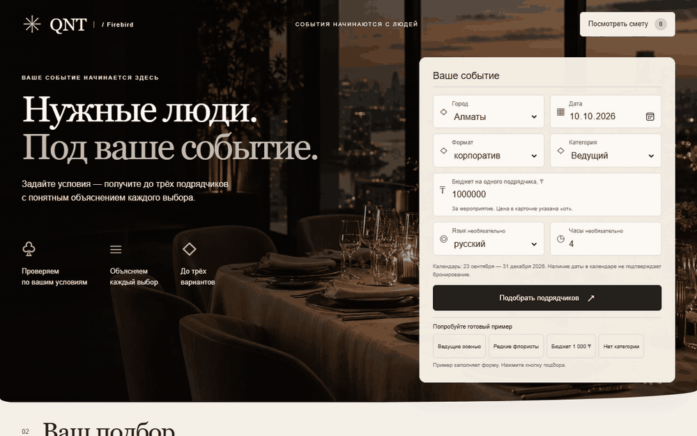
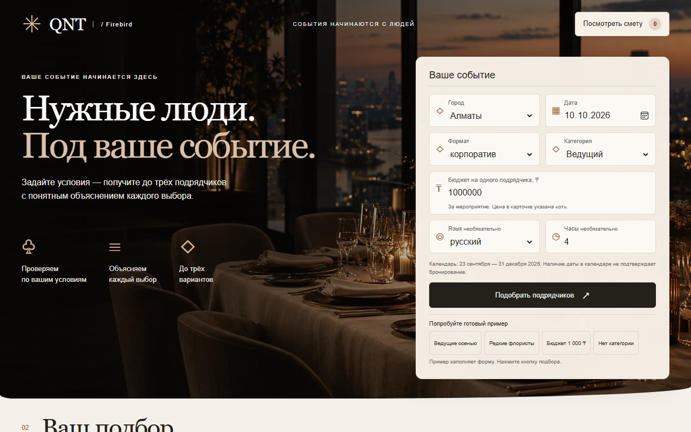
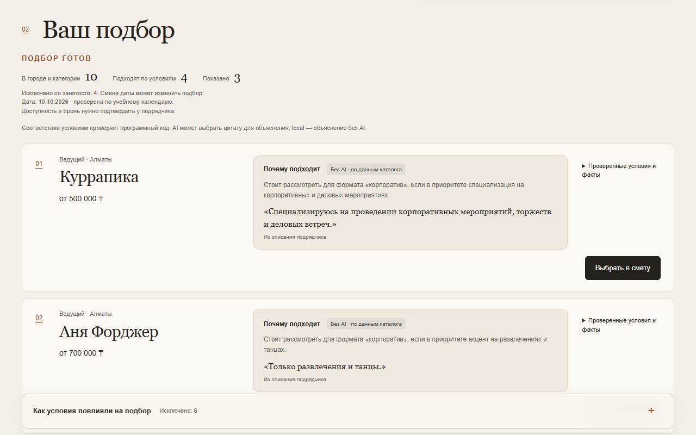
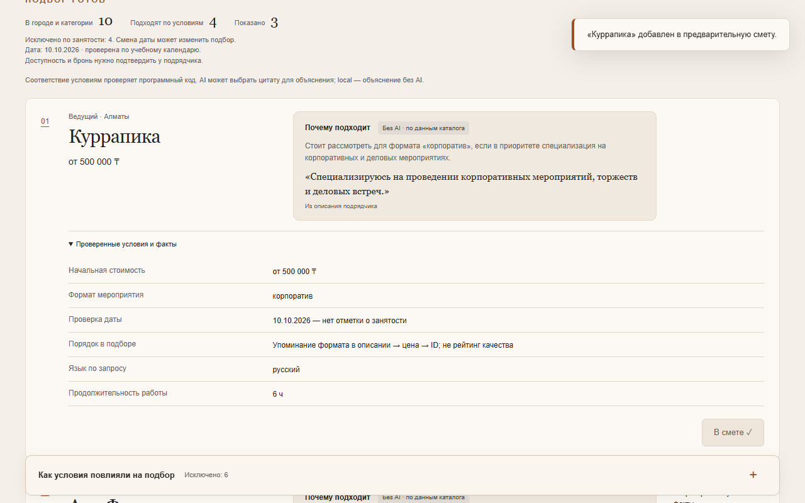
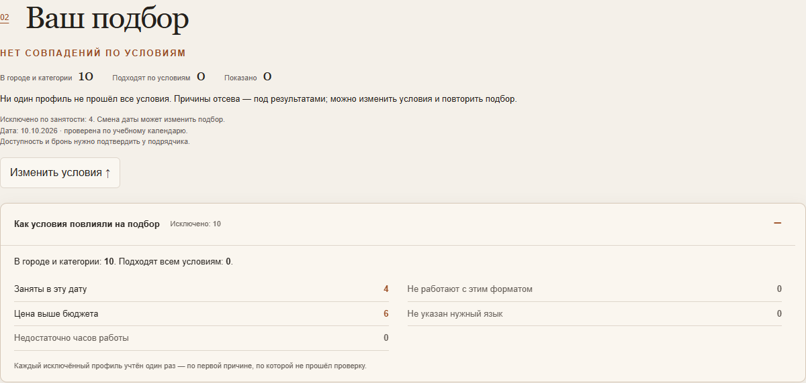

# QNT · Firebird

**Умный подбор подрядчиков для организаторов мероприятий.** Вместо просмотра длинного каталога задайте условия события и получите до трёх подходящих вариантов с ценами «от», объяснениями и проверяемыми фактами. Выбранных подрядчиков можно собрать в предварительную смету и скачать PDF.

**[Открыть демо](https://qnt.l33t.kz/)** · [Проверка проекта](docs/ORGANIZER_AUDIT.md) · [Источник данных](data/README.md)



*GIF записан с текущего `main` и настоящего локального API без AI-ключа; UI-деморежим выключен. Анимация повторяется, статичные кадры — ниже.*

<details>
<summary>Скриншоты: главная, выдача, выбор и пустой результат</summary>









</details>

## Что реализовано

- **Подбор по условиям:** город, дата, формат, категория и бюджет; язык и длительность — по желанию. Код проверяет условия, учитывает учебный календарь занятости и возвращает до трёх карточек.
- **Прозрачные объяснения:** причины выбора, факты из каталога и причины отсева. `local` означает объяснение без AI; при включённом AI модель может выбрать цитату из описания, но не меняет фильтрацию и порядок выдачи.
- **Предварительная смета:** выбор и замена подрядчиков, сохранение черновика в браузере, экспорт PDF. Цены указаны **«от» за подрядчика на мероприятие**; синтетические и дополненные данные отмечены.

## Как работает решение

1. Организатор вводит параметры события. Интерфейс получает справочники через `/api/options` и отправляет запрос в `/api/match`.
2. Сервер проверяет входные данные, отбирает профили из каталога и детерминированно упорядочивает подходящих. Объяснение использует факты и исходное описание подрядчика; AI необязателен.
3. Интерфейс показывает до трёх карточек или понятную пустую выдачу. Пользователь раскрывает основания выбора и добавляет нужных подрядчиков в смету.

## Технологии и архитектура

| Компонент | Технологии и роль |
|---|---|
| Интерфейс | TypeScript, React, Vite. Форма, карточки, локальная смета; `pdf-lib` и `@pdf-lib/fontkit` создают PDF в браузере. |
| API | Python, FastAPI, Pydantic. Валидация, фильтрация, порядок выдачи и формирование объяснений; тот же сервер раздаёт собранный интерфейс. |
| Данные и AI | CSV-каталог организатора кейса. Без ключа работает локальный выбор фактов; опционально OpenAI Responses API (`gpt-4.1-mini`) выбирает цитату из разрешённых фрагментов. |

Запрос проходит путь **форма → API → каталог и алгоритм подбора → карточки → смета/PDF в браузере**. AI не принимает решение о соответствии условиям.

## Установка и запуск без ключа

Нужны Python 3.10–3.12 и Node.js 22.12+. Из корня репозитория:

```bash
cd frontend
npm ci
npm run build
cd ..
python3 -m venv .venv
source .venv/bin/activate
python -m pip install -r backend/requirements.txt
python -m uvicorn app.main:app --app-dir backend --host 127.0.0.1 --port 8000
```

Откройте **http://127.0.0.1:8000/**. API и интерфейс доступны с одного адреса. По умолчанию AI и UI-деморежим выключены; ключ и аккаунт не требуются. В Windows PowerShell используйте `npm.cmd`, создайте окружение командой `py -3.12 -m venv .venv` и активируйте `.venv\Scripts\Activate.ps1`.

## Как проверить

1. Оставьте пример в форме: **Алматы · 10.10.2026 · корпоратив · Ведущий · 1 000 000 ₸ · русский · 4 часа**. Нажмите «Подобрать подрядчиков». В текущем каталоге ожидаются **4 подходящих профиля, 3 показанные карточки**.
2. Раскройте «Проверенные условия и факты» у первой карточки, нажмите «Выбрать в смету», затем «Посмотреть смету». При желании скачайте PDF.
3. Повторите запрос с бюджетом **1 000 ₸**: интерфейс должен показать пустую выдачу и причины отсева, а не подменять ответ демоданными.

Автоматическая проверка без платных AI-вызовов: `python backend/scripts/judge_check.py`. Отдельно доступны `cd frontend && npm test` и `python -m pytest -q backend/tests`; [последний локальный отчёт](docs/verification-results.json) и [сценарии приёмки](docs/ACCEPTANCE.md) лежат в `docs/`. Зелёного бейджа CI нет: в документации зафиксирован billing-блокер GitHub Actions, успешный run не подтверждён.

## Данные и ограничения

Используется предоставленный организатором CSV-каталог: **66 анонимизированных профилей в 17 категориях**. Часть профилей синтетическая, некоторые города и цены дополнены; интерфейс сохраняет соответствующие метки. [Происхождение и ограничения набора данных](data/README.md). Внешний сервис нужен только для необязательного AI-режима; обычный подбор работает локально без ключа.

Календарь ограничен **23.09–31.12.2026** и не подтверждает реальную доступность или бронирование. Описания и начальные цены нужно уточнять у подрядчика. Интернет-поиск, заявки, оплата и бронирование не входят в текущую версию; смета не является полной стоимостью события.

<details>
<summary>Команда, лицензия и дополнительные материалы</summary>

- **[Бекзат · AbaevnaBeka](https://github.com/AbaevnaBeka):** интерфейс, доступность, карточки, тесты и визуальные материалы.
- **[Естай · Adventkz](https://github.com/Adventkz):** каталог, алгоритм, объяснения, сервер, интеграция и развёртывание.

Код — [MIT](LICENSE); права на каталог определяются его источником отдельно. Для сборки использованы подходы из [agent-kit](https://github.com/Adventkz/agent-kit) (MIT, commit `a510551`); подробности — в [материалах о проекте](docs/SUBMISSION.md). [Результаты AI-проб](docs/ai-eval-results.json) содержат границы оценки.

</details>
